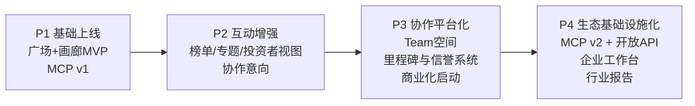

> ⛔ **已归档**（2026-04-19）：本文件代表 v11.0 之前的产品方向，**不再作为当前主线**。
> 当前主线见 `docs/v11.0-final-chapter-rfc.md`，主线索引 `docs/roadmap-current.md`。
> 本文件保留作为历史档案，新工作请勿基于本文件展开。

# VibeHub 项目计划书 v4.0（专业版）

版本：v4.0  
日期：2026-04-14  
适用阶段：0-24个月  
项目定位：开发者社区 + 项目展示网络 + 小团队协作 + Agent 数据层  
战略调整：**开发者优先、小团队优先、企业端降级为旁观者模式**

## 0. 执行摘要
VibeHub 的目标不是单一内容站，而是面向中文 VibeCoding 生态的三位一体平台：
1. 开发者讨论广场：沉淀灵感、方法与实战经验。
2. 项目展示画廊：让产品、团队、技术能力可被企业与投资方快速发现。
3. 协作组队平台：让开发者低摩擦组成 Team 并持续共创。
4. Agent 数据层：把平台内容结构化为 AI Agent 可消费的标准化接口（MCP/API）。

核心战略：先做“高质量供给 + 强互动”，再做“组队协作 + 商业化”，最后做“生态基础设施化”。

## 1. 终局目标与真实产出

## 1.1 终局目标（North Star）
在中文 VibeCoding 领域，成为“人类创作协作网络 + AI Agent 可调用知识基础设施”的事实标准入口。

## 1.2 真实产出（可交付而非口号）
1. 社区资产：高活跃讨论广场与持续增长的高质量主题帖库。
2. 项目资产：可检索、可验证、可持续更新的项目画廊与创作者履历系统。
3. 协作资产：稳定运转的 Team 组队与协作工作流，沉淀可复用协作模板。
4. 数据资产：标准化项目/人才/Prompt/协作元数据，支持 Agent 检索与调用。
5. 商业资产：可持续收入组合（订阅、增值功能、API、撮合服务）。

## 2. 市场机会与判断框架（2026）

## 2.1 需求侧信号
1. AI 编程工具采用率持续上升，开发流程明显“Agent化”。
2. 开发者对“可信知识、可复用实践、同伴协作”的需求同步上升。
3. 中文开发者生态仍缺少“讨论-展示-协作-机器可消费”一体化平台。

## 2.2 供给侧缺口
1. 现有社区多偏资讯和碎片交流，缺少结构化项目沉淀。
2. 现有作品站多偏静态展示，缺少高频互动和协作闭环。
3. 现有协作工具多偏团队内管理，缺少面向陌生协作者组队机制。
4. 面向 Agent 的标准化知识供给不足，导致机器检索与执行上下文不稳定。

## 2.3 竞争策略
1. 不与通用社交平台正面竞争“流量总量”，而竞争“高质量开发协作密度”。
2. 不与单一 AI IDE 比拼“编辑器能力”，而打造“跨工具生态的协作与数据层”。
3. 用“结构化资产 + 开放接口 + 社区治理”形成复利护城河。

## 3. 产品战略与信息架构

## 3.1 三大产品支柱
1. 讨论广场（Inspiration & Interaction）
2. 项目画廊（Showcase & Discovery）
3. 协作平台（Teaming & Delivery）

## 3.2 核心模块定义
1. 广场模块
- 帖子：问题帖、复盘帖、项目日志、工具评测、架构讨论。
- 互动：评论、引用回复、收藏、关注、主题标签。
- 机制：精华评审、周榜、专题月、挑战赛。

2. 画廊模块
- 项目页：问题定义、解决方案、技术栈、Demo、里程碑、关键指标。
- 创作者页：能力画像、代表作、协作偏好、可投入时间。
- 投资者视图：按赛道、成熟度、增长信号筛选项目。

3. 协作模块
- Team 组建：发起招募、角色匹配、贡献规则。
- 协作空间：任务板、里程碑、讨论记录、版本快照。
- 信誉系统：贡献记录、完成率、协作评分。

4. Agent 数据层
- MCP Tool + REST API 双通道。
- 对外暴露结构化检索与详情读取能力。
- 支持人类可读与机器可读双格式输出。

## 3.3 差异化价值主张
1. 对开发者：从“发帖”升级为“作品-协作-成长”的完整路径。
2. 对企业/投资者：从“看热闹”升级为“可检索、可对比、可追踪”的项目发现面板。
3. 对 Agent：从“抓网页”升级为“稳定 schema + 可用接口”的高质量上下文源。

## 4. 阶段性实现图（P1-P4）

## 4.1 P1 基础上线（0-3个月）
目标：让“讨论 + 展示 + 基础检索”可用并形成首批内容供给。

交付物：
1. 讨论广场 MVP：发帖、评论、标签、热门排序。
2. 项目画廊 MVP：项目卡片、详情页、创作者页。
3. 基础检索：按标签、技术栈、阶段检索。
4. MCP v1：`search_projects`、`get_project_detail`、`search_creators`。
5. 内容规范：项目提交模板、质量标准、审核规则。

阶段门槛（Go/No-Go）：
1. 周活跃讨论用户（WAU）达标。
2. 项目页完整度达标（字段完整率、可访问率）。
3. 首批高质量项目供给稳定。

## 4.2 P2 互动增强（3-6个月）
目标：建立“发布-发现-反馈-再发布”飞轮。

交付物：
1. 精华机制、周榜、专题页、挑战赛活动页。
2. 投资者筛选视图（只读版）。
3. “我想加入/我在招募”协作意向入口。
4. 创作者成长面板（浏览、互动、收藏、关注趋势）。

阶段门槛：
1. 讨论帖有效互动率达标。
2. 项目页二次更新率达标。
3. 协作意向配对成功率达到最低可用标准。

## 4.3 P3 协作平台化（6-12个月）
目标：让组队开发成为平台核心生产行为。

交付物：
1. Team 体系：团队主页、角色权限、成员申请与审核。
2. 协作空间：任务看板、里程碑、协作日志。
3. 信誉系统：按贡献行为沉淀公开协作信用。
4. 商业化首发：Pro 订阅（$9/月），仅 Free + Pro 两档。

阶段门槛：
1. 新增项目中 Team 项目占比达标。
2. Team 项目里程碑完成率达标。
3. 商业化形成稳定复购信号。

## 4.4 P4 生态基础设施化（12-24个月）
目标：从平台产品升级为行业基础设施。

交付物：
1. MCP v2（多工具、权限分级、审计日志）。
2. 开放 Widget/API（外部站点可嵌入项目与团队信息）。
3. 企业项目雷达（轻量旁观者模式：普通注册 + 公开 API 浏览，无需专属认证）。
4. 生态报告产品化（季度报告、年度趋势报告）。

## 5. 商业模式与收入结构

## 5.1 收入来源（v4.0 简化为两档）
1. **Pro 个人订阅 ($9/月)**：更多项目空间、曝光机会、开发者工具增强。
2. API 超额调用（远期）：面向高频 Agent/工具集成。

**已移除或推迟：**
- ~~Team Pro（¥99/月）~~：前期用户基数不足以支撑多档位。
- ~~企业席位~~：等待市场 PMF 信号。
- ~~服务收入~~：当前阶段不分散精力。

## 5.2 定价原则
1. 只有 Free 和 Pro 两档，决策摩擦最低。
2. $9/月（全球 USD 定价），对标“一杯咖啡”心智。
3. Free 不设任何社区功能墙——发帖、评论、加入团队永久免费。
4. Pro 的核心卖点是“更多空间 + 更多曝光”，不是“解锁基础功能”。

## 5.3 单位经济模型
核心公式：
MRR = MAU × Pro 转化率 × $9

管理指标：
1. Pro 转化率（目标 ≥ 2%）
2. Pro 月留存率（目标 ≥ 80%）
3. CAC（获客成本）
4. LTV = ARPPU × 平均订阅月数

## 6. 增长与运营体系

## 6.1 增长飞轮
高质量讨论 -> 高质量项目沉淀 -> 高可信展示 -> 更多协作配对 -> 更多成功案例 -> 吸引更多开发者/企业/投资者。

## 6.2 渠道策略
1. 内容渠道：技术复盘、项目拆解、榜单报告。
2. 社区渠道：开发者社群、技术论坛、开源社区。
3. 生态渠道：与 AI 工具社区联合活动。
4. 口碑渠道：展示“从发帖到组队到上线”的完整案例。

## 6.3 运营制度
1. 内容分层审核（机器预筛 + 人工复核）。
2. 主题运营节奏（周主题、月挑战、季报告）。
3. 关键用户计划（创作者导师、早期团队扶持）。

## 7. 技术架构与数据架构

## 7.1 技术栈建议
1. 前端：Next.js + Tailwind + 组件系统。
2. 后端：TypeScript 服务层 + PostgreSQL。
3. 搜索：PostgreSQL FTS（早期）-> 独立搜索引擎（中期）。
4. 向量检索：pgvector（用于语义检索与推荐增强）。
5. 分析：事件埋点 + 行为分析平台。
6. 接口：REST API + MCP Server。

## 7.2 核心数据对象
1. User
2. CreatorProfile
3. Project
4. DiscussionPost
5. Comment
6. Team
7. TeamMembership
8. CollaborationTask
9. PromptTemplate
10. APIKey / UsageLog

## 7.3 平台治理能力
1. 权限模型（用户、创作者、团队管理员、企业观察者）。
2. 审计日志（内容、协作、接口调用）。
3. 数据可追溯（版本与变更记录）。

## 8. 合规、安全与风控

## 8.1 中国境内关键合规要求（按业务相关性）
1. 生成式AI服务相关规范（如涉及AIGC输出能力）。
2. 深度合成与算法推荐相关规范（如涉及推荐与生成分发）。
3. ICP/备案与平台信息服务合规要求。
4. 个人信息保护、数据安全、未成年人保护义务。

## 8.2 平台控制措施
1. 内容治理：违规识别、分级处置、申诉机制。
2. 隐私治理：最小化采集、敏感信息脱敏、可删除机制。
3. Agent 风险治理：工具白名单、最小权限、关键操作二次确认。
4. 安全运营：漏洞扫描、依赖治理、应急响应预案。

## 8.3 组队协作风控
1. 团队纠纷处理机制。
2. 代码与资产归属声明模板。
3. 商业合作免责声明与平台责任边界。

## 9. 组织与执行机制（One-Person Company + AI Agents）

## 9.1 人机协同分工
1. 创始人负责：战略、产品取舍、关键合作、社区关键节点。
2. AI Agents 负责：代码生成、测试辅助、内容初稿、运营自动化。
3. 外包与合作：设计、法律、财务等非核心高专业环节。

## 9.2 周期化管理
1. 每周：产品迭代评审 + 指标复盘。
2. 每月：阶段目标校准 + 风险清单更新。
3. 每季度：路线图调整与资源重分配。

## 10. KPI 体系（按阶段）

## 10.1 北极星指标
“每月产生有效协作结果的活跃项目数”。

## 10.2 P1-P4 关键KPI
1. P1：WAU、项目完整度、检索成功率、7日留存。
2. P2：有效互动率、项目更新率、协作意向转化率。
3. P3：Team项目占比、里程碑完成率、MRR、付费留存。
4. P4：API调用量、企业席位数、生态报告引用量。

## 11. 风险清单与对策
1. 风险：供给不足。对策：模板化投稿与核心创作者计划。
2. 风险：低质量灌水。对策：分级审核与信誉约束。
3. 风险：协作失败率高。对策：角色清晰化与任务模板化。
4. 风险：商业化转化弱。对策：先做高价值单点付费能力。
5. 风险：合规与安全事件。对策：前置审查、分级响应、合规台账。

## 12. 里程碑与验收
1. M1（P1结束）：平台可用，讨论与画廊形成基础供给。
2. M2（P2结束）：互动飞轮建立，投资者视图与协作意向可用。
3. M3（P3结束）：Team协作成为主行为，商业化稳定起量。
4. M4（P4结束）：开放生态成型，VibeHub具备基础设施属性。

## 13. 计划书附录：外部依据（更新到 2026-04-12）
1. GitHub Octoverse 2025（开发者增长与仓库增长）：https://github.blog/news-insights/octoverse/octoverse-a-new-developer-joins-github-every-second-as-ai-leads-typescript-to-1/
2. Stack Overflow Developer Survey 2024（AI 工具使用/计划使用 76%）：https://survey.stackoverflow.co/2024
3. Stack Overflow Developer Survey 2025 AI（AI 工具使用/计划使用 84%）：https://survey.stackoverflow.co/2025/ai
4. 国家网信办《生成式人工智能服务管理暂行办法》发布（2023-08-15施行）：https://www.cac.gov.cn/2023-07/13/c_1690898326795531.htm
5. 《互联网信息服务算法推荐管理规定》发布信息（2022-03-01施行）：https://www.gov.cn/xinwen/2022-01/04/content_5666387.htm
6. 《互联网信息服务深度合成管理规定》政策解读（2023-01-10施行）：https://www.gov.cn/zhengce/2022-12/12/content_5731430.htm
7. 市场监管总局经营主体数据（2024年末1.89亿户）：https://www.gov.cn/lianbo/bumen/202501/content_6997839.htm
8. 全国个体工商户规模（1.25亿户）相关口径：https://www.gov.cn/lianbo/bumen/202408/content_6968776.htm
9. MCP 安全风险参考（OWASP MCP Top 10）：https://owasp.org/www-project-mcp-top-10/
10. 竞品定价页（用于竞品分析更新）：
- Cursor: https://www.cursor.com/en/pricing
- Replit: https://replit.com/pricing
- GitHub Copilot: https://github.com/features/copilot/plans
- v0: https://v0.dev/pricing

---

本版为战略与执行一体化文本，可直接作为融资路演底稿、团队执行蓝图和对外合作说明书。建议后续补充你已掌握的真实内测数据，形成 v3.1 数据版。
