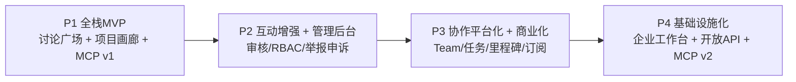

# VibeHub 实现计划图（阶段制）

版本：v1.9  
更新日期：2026-04-12

## 总体路线

## P1 当前已落地（本仓库）

1. Next.js 全栈骨架（App Router + API Route）
2. 讨论广场 API 与页面
3. 项目画廊 API 与页面
4. 创作者 API 与详情页
5. MCP v1 三个只读工具端点
6. 统一 `/api/v1` 响应协议
7. PostgreSQL + Prisma 模型与 seed 脚本
8. 自托管部署模板（Nginx/PM2/Postgres）

## 阶段门禁（强约束）

1. P1 -> P2：核心链路可用率、检索成功率、项目字段完整率、7日留存达标
2. P2 -> P3：有效互动率、项目二次更新率、审核SLA达标
3. P3 -> P4：Team项目占比、里程碑完成率、付费转化/留存达标

## 变更记录

| 日期 | 版本 | 变更 |
|---|---|---|
| 2026-04-12 | v1.0 | 初始化阶段实现图并与代码仓库对齐 |
| 2026-04-12 | v1.1 | 补充 P1 门禁执行结果（安全修复、测试链路、CI 自动验收） |
| 2026-04-12 | v1.2 | P2 全量收口：按 P2-1…P2-5 汇总执行记录，并对照计划书标注延期项 |
| 2026-04-12 | v1.3 | 启动 P3：`Team` + `TeamMembership`、公开团队 API 与 `/teams` 最小页面（P3-1） |
| 2026-04-12 | v1.4 | P3-2：团队入队改为申请 + 队长审批（`TeamJoinRequest`） |
| 2026-04-12 | v1.5 | P3-3：项目可选归属团队（`Project.teamId`）、发现页按团队筛选、创建者 PATCH 绑定 |
| 2026-04-12 | v1.6 | P3-4：团队轻量任务板 `TeamTask`（todo/doing/done）、成员 API + `/teams/[slug]` 任务区 |
| 2026-04-12 | v1.7 | P3-5：`TeamMilestone` 时间线（目标日、完成态、sortOrder）；mock 成员行 id 去重修复 |
| 2026-04-12 | v1.8 | P3-6：`TeamTask.sortOrder`、列表排序、创建默认递增、PATCH 可选 sortOrder、`POST .../tasks/:id/reorder` |
| 2026-04-12 | v1.9 | P3-1…P3-6 全量代码审计与收口：合并主线、`createTeam` slug 冲突长度修复（BUG-P3-1-002）、文档与 Debug 表闭环 |

## P3-1…P3-6 Full Audit Closure (2026-04-12)

- **Scope**: Prisma 迁移 `20260412140000` … `20260412230000`；`web/src/app/api/v1/teams/**`、`projects/[slug]`、`me/teams`、discover/MCP 团队筛选；`repository` 团队/入队/项目绑定/任务/里程碑与 Vitest。
- **Fix shipped**: `buildTeamSlugCandidate` 保证冲突后缀下 slug **≤48**，mock 与 PostgreSQL 路径一致。
- **Deferred (documented)**: 任务板仍为「任意成员可删任意任务」MVP；`createTeam` DB 路径 slug 碰撞最多尝试 20 次（极端高密度碰撞需产品或运维策略）。

## P3-6 Execution Update (2026-04-12)

- **Data**: `TeamTask.sortOrder` (default 0), index `(teamId, sortOrder)`; migration `20260412230000_p3_6_team_task_sort_order`.
- **API**: optional `sortOrder` on `POST/PATCH .../tasks`; `POST .../tasks/:taskId/reorder` with `{ direction: "up" | "down" }` returns `{ tasks }` (full ordered list).
- **Repo**: `listTeamTasks` orders by `sortOrder` then `updatedAt`; `createTeamTask` appends with `max+1` when `sortOrder` omitted; `reorderTeamTask` swaps adjacent rows (mock + Prisma).
- **UI**: `TeamTasksPanel` 上移/下移 buttons.
- **Seed**: explicit `sortOrder` on seeded team tasks.

## P3-5 Execution Update (2026-04-12)

- **Data**: `TeamMilestone` (`title`, `description?`, `targetDate`, `completed`, `sortOrder`, `createdByUserId`); migration `20260412220000_p3_5_team_milestones`.
- **API**: `GET/POST /api/v1/teams/:slug/milestones`; `PATCH/DELETE .../milestones/:milestoneId` (members only).
- **UI**: `TeamMilestonesPanel` on `/teams/[slug]` (date picker uses UTC noon for ISO consistency).
- **Seed**: replace+create two milestones for `vibehub-core`.
- **Mock fix**: `mockTeamMemberships` rows use composite ids to avoid `removeTeamMember` deleting wrong row when `Date.now()` collides (same class of bug as P3-2 join requests).

## P3-4 Execution Update (2026-04-12)

- **Data**: `TeamTask` + `TeamTaskStatus`; migration `20260412200000_p3_4_team_tasks`; seed replaces then inserts two tasks on `vibehub-core`.
- **Rules**: list/create/update/delete require **team membership**; assignee must be a member; any member may mutate tasks (MVP).
- **API**: `GET/POST /api/v1/teams/:slug/tasks`; `PATCH/DELETE /api/v1/teams/:slug/tasks/:taskId`.
- **UI**: `TeamTasksPanel` on team detail (client fetch); CSS `.status-todo|doing|done`.
- **Tests**: `tests/team-task-repository.test.ts`.

## P3-3 Execution Update (2026-04-12)

- **Data**: optional `Project.teamId` FK → `Team` (`ON DELETE SET NULL`); migration `20260412180000_p3_3_project_team_link`.
- **API**: `GET /api/v1/projects` and MCP `search_projects` accept `team=<teamSlug>`; `GET /api/v1/projects/:slug` returns `team` summary; `PATCH /api/v1/projects/:slug` with `{ "teamSlug": "..." | null }` (creator only, must be team member); `GET /api/v1/me/teams` lists teams for session user.
- **UI**: `/discover` team filter; team detail shows linked projects + link to discover; project detail shows `ProjectTeamLinkForm` for creator; `ProjectCard` shows team when set.
- **Seed**: links `vibehub` project to `vibehub-core` team after team upsert.
- **Tests**: `tests/team-project-link.test.ts`, `project-list-filters` team filter case.

## P3-1 Execution Update (2026-04-12)

- Data: `Team` (slug, name, mission, ownerUserId), `TeamMembership` (unique teamId+userId, role `owner` | `member`), migration `20260412140000_p3_1_teams`.
- API: `GET/POST /api/v1/teams`, `GET /api/v1/teams/:slug`, `POST /api/v1/teams/:slug/members` (owner adds by email), `DELETE /api/v1/teams/:slug/members/:userId` (self-leave or owner removes member).
- UI: `/teams`, `/teams/[slug]`, nav **Teams**; seed team `vibehub-core` in `prisma/seed.ts`.
- Tests: `tests/team-repository.test.ts`.

## P3-2 Execution Update (2026-04-12)

- **Join flow change**: `POST /api/v1/teams/:slug/join` now creates a **`TeamJoinRequest`** (pending) instead of immediate membership; owner approves or rejects via `POST /api/v1/teams/:slug/join-requests/:requestId/review` with `{ "action": "approve" | "reject" }`.
- **Data**: `TeamJoinRequest` + `TeamJoinRequestStatus`, unique `(teamId, applicantId)`; migration `20260412160000_p3_2_team_join_requests`.
- **Detail API/page**: `GET /api/v1/teams/:slug` and server page pass session so response can include `viewerPendingJoinRequest` and owner-only `pendingJoinRequests`.
- **Invite by email**: still direct-add; clears any pending join request for that user on the team (DB + mock).
- **Re-apply after reject**: same `(teamId, applicantId)` row is updated back to `pending` (unique constraint friendly).
- **Tests**: extended `tests/team-repository.test.ts` for request/approve/reject paths.

## P2 执行切片（P2-1 — P2-5，按交付顺序）

### P2-1 Execution Update (2026-04-12)

- Admin RBAC (demo session + `requireAdminSession`), moderation queue for posts, user list, reports and audit log listing APIs; admin UI routes under `/admin/*`.
- Quality gate: `npm run check` maintained on admin routes.

### P2-2 Execution Update (2026-04-12)

- Collaboration intent loop for project pages (`join` / `recruit`) with API and admin moderation queue.
- `CollaborationIntent` model, repository flows, audit log actions; admin collaboration queue and review endpoint.
- Tests: `tests/collaboration-intent-repository.test.ts`.

### P2-3 Execution Update (2026-04-12)

- Topic collections: curated slugs in `src/lib/topics-config.ts`, pages `/collections` and `/collections/[slug]`, APIs `GET /api/v1/collection-topics` and `GET /api/v1/collection-topics/[slug]`.
- Leaderboards: `/leaderboards` plus `GET /api/v1/leaderboards/discussions` and `GET /api/v1/leaderboards/projects` (all-time comment count and collaboration intent volume).
- Collaboration intent funnel: `GET /api/v1/metrics/collaboration-intent-funnel` and admin dashboard section fed by `getCollaborationIntentConversionMetrics`.
- Tests: `tests/p2-3-discovery-metrics.test.ts` (mock data path).

### P2-4 Execution Update (2026-04-12)

- Project discovery (ops / external radar): page `/discover` with GET form (shareable query string: `query`, `tag`, `tech`, `status`, `page`, `limit`).
- API: `GET /api/v1/projects` accepts `tech` and `status`; `GET /api/v1/projects/facets` returns distinct `tags` and `techStack` for filter dropdowns; MCP `search_projects` accepts the same optional filters with strict `status` validation.
- Repository: `listProjects` extended filters; `getProjectFilterFacets`; tests in `tests/project-list-filters.test.ts`.

### P2-5 Execution Update (2026-04-12)

- Weekly leaderboards: UTC weeks (Monday boundary); live queries count comments or collaboration intents created within `[weekStart, weekStart+7d)`.
- Materialized snapshots: Prisma models `WeeklyLeaderboardSnapshot` and `WeeklyLeaderboardRow`, migration `20260412120000_p2_5_weekly_leaderboard_snapshots`.
- Public APIs: `GET /api/v1/leaderboards/weekly/discussions` and `GET /api/v1/leaderboards/weekly/projects` with optional `week=YYYY-MM-DD` (Monday); responses include `source: materialized | live`.
- Admin: `POST /api/v1/admin/leaderboards/weekly/materialize` plus dashboard form; audit action `weekly_leaderboard_materialized`.
- UI: `/leaderboards` shows all-time and weekly panels with week navigation query string.
- Tests: `tests/p2-5-weekly-leaderboards.test.ts`.

## P2 对照《项目计划书》4.2 的收口结论（2026-04-12）

| 计划书交付物 | 本仓库状态 | 说明 |
|---|---|---|
| 精华机制 | 未单独建模 | 审核通过帖即公开展示；无「精华」标签或加权排序 |
| 周榜 | 已交付 | 全量榜（P2-3）+ UTC 周榜与可选物化快照（P2-5） |
| 专题页 | 已交付 | 配置驱动专题 `/collections`（P2-3） |
| 挑战赛活动页 | 未交付 | 可作为 P3 或运营子项目 |
| 投资者筛选视图（只读） | 已交付（运营向） | `/discover` + 项目筛选 API / MCP（P2-4） |
| 协作意向入口 | 已交付 | 项目页提交 + 管理端审核（P2-2） |
| 创作者成长面板 | 未交付 | 浏览/互动趋势未做；可进 P3 |
