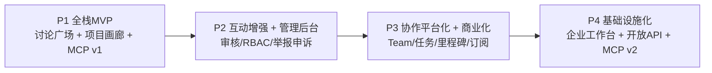

# VibeHub 实现计划图（阶段制）

版本：v1.0  
更新日期：2026-04-12

## 总体路线

## P1 当前已落地（本仓库）

1. Next.js 全栈骨架（App Router + API Route）
2. 讨论广场 API 与页面
3. 项目画廊 API 与页面
4. 创作者 API 与详情页
5. MCP v1 三个只读工具端点
6. 统一 `/api/v1` 响应协议
7. PostgreSQL + Prisma 模型与 seed 脚本
8. 自托管部署模板（Nginx/PM2/Postgres）

## 阶段门禁（强约束）

1. P1 -> P2：核心链路可用率、检索成功率、项目字段完整率、7日留存达标
2. P2 -> P3：有效互动率、项目二次更新率、审核SLA达标
3. P3 -> P4：Team项目占比、里程碑完成率、付费转化/留存达标

## 变更记录

| 日期 | 版本 | 变更 |
|---|---|---|
| 2026-04-12 | v1.0 | 初始化阶段实现图并与代码仓库对齐 |
