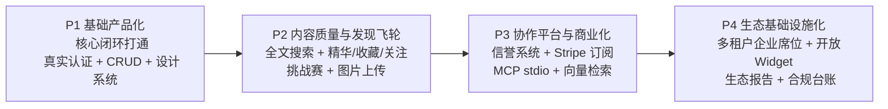
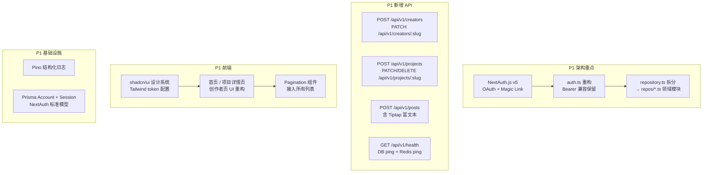

# VibeHub 正式产品路线图

版本：v1.0  
日期：2026-04-13  
依据：`docs/04_正式产品计划书_v4.0.md`

---

## 总体路线



---

## P1：基础产品化（核心闭环打通）

**目标**：让真实用户能完成"注册 → 建立创作者主页 → 发帖/发布项目 → 被发现"完整路径。



### P1 模型分工

| 任务 | 模型 | 说明 |
|---|---|---|
| NextAuth.js v5 集成（OAuth + Magic Link） | Claude Opus 4.6 | 需兼容现有 Bearer API Key 认证路径，架构决策复杂 |
| `auth.ts` 重构：session → NextAuth adapter | Claude Opus 4.6 | 安全敏感，涉及 cookie 签名、CSRF 策略迁移 |
| `repository.ts` 拆分为领域模块 | Claude Opus 4.6 | 4300+ 行重构，需保证 mock/DB 双路径分离不引入回归 |
| `POST/PATCH /api/v1/creators` CRUD | Claude Sonnet 4.5 | 标准 CRUD，schema 已有，参照现有 route 模式 |
| `POST/PATCH/DELETE /api/v1/projects` CRUD | Claude Sonnet 4.5 | 标准 CRUD，需新增 slug 生成、权限校验 |
| `POST /api/v1/posts`（带 Tiptap 编辑器） | Claude Sonnet 4.5 | API 标准，Tiptap 前端接入参照文档 |
| Prisma schema 新增 `Account`、`Session` | Claude Sonnet 4.5 | NextAuth 标准模型，迁移脚本 |
| 健康检查升级（DB ping + Redis ping） | Claude Sonnet 4.5 | 简单端点扩展 |
| Pino 结构化日志接入 | Claude Sonnet 4.5 | 标准库接入，格式配置 |
| 新增 CRUD repository 单元测试 | Claude Sonnet 4.5 | Vitest，参照现有 test 文件风格 |
| shadcn/ui 安装 + 全局设计系统建立 | Gemini 2.5 Pro | 组件库落地、Tailwind token 配置、Typography 基础样式 |
| 首页 / 项目详情页 / 创作者页 UI 重构 | Gemini 2.5 Pro | 响应式布局、卡片美化、Hero 正式化 |
| `Pagination` 组件 + 列表分页 UI | Gemini 2.5 Pro | 通用分页组件，接入所有列表页 |
| P1 封版审计：类型安全 + 边界条件 + 迁移链 review | GPT-5.3 | 全模块 code review，输出问题清单，P0/P1 清零后封版 |

### P1 关键文件变更

- `web/src/lib/repository.ts` → 拆分为 `web/src/lib/repos/*.ts`
- `web/src/app/api/v1/creators/route.ts` 新增 POST
- `web/src/app/api/v1/projects/route.ts` 新增 POST
- `web/src/app/auth/` 新增 NextAuth 路由
- `web/prisma/schema.prisma` 新增 `Account`、`Session`

### P1 封版条件

- `npm run check`（lint + test + validate:openapi + build）全绿
- 新增核心 CRUD 的 repository 单测覆盖
- GPT-5.3 审计报告 P0/P1 问题清零

---

## P2：内容质量与发现飞轮

**目标**：内容从"展示"升级为"可被发现、可互动、有排名、有质量筛选"。

```mermaid
flowchart TD
    subgraph p2_search ["P2 搜索与索引"]
        E1["PostgreSQL tsvector\nGIN 索引 + 滚动迁移"]
        E2["projects + posts\n全文检索支持"]
        E1 --> E2
    end

    subgraph p2_interaction ["P2 互动机制"]
        F1["Post.featured\n精华机制 + 管理员 API"]
        F2["PostBookmark\n收藏"]
        F3["Follow\n关注创作者"]
        F4["协作意向配对后\n下游通知触发"]
        F1 --- F2 --- F3 --- F4
    end

    subgraph p2_content ["P2 内容扩展"]
        G1["Challenge 挑战赛\n模型 + 管理端 + 活动页"]
        G2["ProjectView 浏览量\n埋点 + 聚合"]
        G3["GET /me/stats\n创作者成长面板"]
        G1 --- G2 --> G3
    end

    subgraph p2_infra ["P2 基础设施"]
        H1["BullMQ + Redis\n异步任务队列"]
        H2["Cloudflare R2\n预签名 URL 上传"]
        H1 --- H2
    end
```



### P2 新增数据模型

```
PostBookmark(userId, postId)          -- 帖子收藏
Follow(followerId, followeeId)        -- 关注创作者
Challenge(slug, title, description, startDate, endDate, status)  -- 挑战赛
ProjectChallenge(projectId, challengeId)  -- 项目参赛关联
ProjectView(projectId, date, count)   -- 浏览量聚合
```

### P2 模型分工

| 任务 | 模型 | 说明 |
|---|---|---|
| PostgreSQL `tsvector` FTS 方案设计 + 迁移策略 | Claude Opus 4.6 | 大表滚动迁移策略、GIN 索引权重调优 |
| BullMQ + Redis 异步任务队列架构 | Claude Opus 4.6 | 队列拓扑、重试策略、死信队列、与现有 Redis 限流共存 |
| Cloudflare R2 文件上传（预签名 URL） | Claude Opus 4.6 | 安全边界（文件类型、大小、访问控制）设计 |
| 精华机制 API（`Post.featured`、权限校验） | Claude Sonnet 4.5 | 管理员专属，PATCH endpoint + 审核流更新 |
| `PostBookmark` / `Follow` 模型 + API | Claude Sonnet 4.5 | 标准关联表 CRUD，unique 约束 |
| `Challenge` 模型 + 挑战赛 API + 管理端入口 | Claude Sonnet 4.5 | 新实体，参照 CollaborationIntent 模式 |
| `GET /api/v1/me/stats` 创作者成长面板 | Claude Sonnet 4.5 | 聚合查询，参照现有 leaderboard 模式 |
| `ProjectView` 浏览量埋点 + 聚合 | Claude Sonnet 4.5 | 轻量日志表 + 定时聚合 |
| 新增 P2 模型 Vitest 单测 | Claude Sonnet 4.5 | Bookmark/Follow/Challenge/View |
| 讨论广场页面全面重构（精华标签、收藏按钮、关注按钮） | Gemini 2.5 Pro | 交互状态管理、动效、空状态设计 |
| 创作者成长面板 UI（趋势图、数据卡片） | Gemini 2.5 Pro | 数据可视化，Recharts |
| 挑战赛活动页 UI | Gemini 2.5 Pro | 活动卡片、进度展示、参与入口 |
| 图片上传 UI（头像裁剪、项目截图预览） | Gemini 2.5 Pro | 文件拖拽、裁剪、进度条 |
| Loading skeleton 全覆盖（所有列表+详情页） | Gemini 2.5 Pro | shadcn/ui Skeleton 组件接入 |
| P2 封版审计：FTS 查询性能 + 队列幂等性 + 上传安全 | GPT-5.3 | 重点审查并发与边界场景 |

### P2 封版条件

- 全文搜索端到端可用（projects + posts）
- 精华/收藏/关注功能完整且有单测覆盖
- BullMQ 队列幂等性验证通过
- GPT-5.3 审计并发与边界场景问题清零

---

## P3：协作平台与商业化

**目标**：Team 协作成为核心生产行为，信誉系统上线，商业化首发。

```mermaid
flowchart TD
    subgraph p3_reputation ["P3 信誉系统"]
        I1["ContributionRecord\n贡献记录建模"]
        I2["评分聚合 API\n按 teamId/userId"]
        I3["公开信誉展示\n团队主页 + 创作者页"]
        I1 --> I2 --> I3
    end

    subgraph p3_payment ["P3 商业化"]
        J1["Stripe 订阅\ncheckout/cancel/renewal/refund 状态机"]
        J2["Subscription 模型\n权益校验中间件"]
        J3["Pro / Team Pro\n权益门控"]
        J1 --> J2 --> J3
    end

    subgraph p3_search ["P3 搜索升级"]
        K1["Meilisearch 集成\n替换 PostgreSQL FTS"]
        K2["pgvector\n语义相似推荐"]
        K1 --- K2
    end

    subgraph p3_mcp ["P3 MCP 升级"]
        L1["独立 mcp-server/ 包\nstdio 标准协议"]
        L2["兼容真实 MCP 客户端"]
        L1 --> L2
    end

    subgraph p3_team ["P3 Team 增强"]
        M1["TeamDiscussion\n团队讨论板"]
        M2["Team.visibility\npublic/invite_only/private"]
        M3["拖拽看板\n@dnd-kit/core 跨列"]
        M1 --- M2 --- M3
    end
```



### P3 新增数据模型

```
ContributionRecord(userId, teamId, taskId, type, score, createdAt)  -- 贡献记录
TeamDiscussion(teamId, authorId, body, createdAt)                   -- 团队讨论
Subscription(userId, plan, status, stripeSubscriptionId, currentPeriodEnd)  -- 订阅
```

### P3 模型分工

| 任务 | 模型 | 说明 |
|---|---|---|
| Stripe 订阅集成（webhook 幂等性、状态机） | Claude Opus 4.6 | 完整处理 checkout/cancel/renewal/refund 状态机 |
| 信誉系统算法设计 + `ContributionRecord` 建模 | Claude Opus 4.6 | 评分权重、防刷机制、公开算法透明度方案 |
| MCP stdio 标准服务（独立 `mcp-server/` 包） | Claude Opus 4.6 | 协议兼容性复杂，需适配真实 MCP 客户端 |
| pgvector 向量嵌入方案（embedding 生成 + 检索） | Claude Opus 4.6 | 向量维度选型、相似度算法、增量更新策略 |
| Meilisearch 集成（替换 FTS，索引同步管道） | Claude Opus 4.6 | 数据同步策略、回退方案、过滤规则配置 |
| `ContributionRecord` CRUD + 聚合 API | Claude Sonnet 4.5 | 标准记录表，按 teamId/userId 聚合 |
| `TeamDiscussion` 模型 + 团队讨论 API | Claude Sonnet 4.5 | 参照 Post/Comment 模式 |
| `Subscription` 模型 + 权益校验中间件 | Claude Sonnet 4.5 | Pro 权益门控，参照 API key scope 模式 |
| `Team.visibility` 字段 + 访问控制更新 | Claude Sonnet 4.5 | PATCH endpoint + 列表过滤逻辑 |
| 内容举报 SLA 字段 + 管理端逾期提醒 | Claude Sonnet 4.5 | `ReportTicket` schema 扩展 |
| Stripe webhook + 信誉算法 + pgvector 单测 | Claude Sonnet 4.5 | 重点覆盖幂等性和边界输入 |
| 拖拽看板 UI（`@dnd-kit/core` 跨列拖拽） | Gemini 2.5 Pro | DnD 交互、列动画、乐观更新 |
| 订阅/定价页 UI（Pro/Team Pro 方案对比） | Gemini 2.5 Pro | 定价卡、CTA、Stripe Checkout 跳转 |
| 信誉评分公开展示 UI（团队主页、创作者页） | Gemini 2.5 Pro | 评分徽章、贡献历史时间线 |
| 团队讨论板 UI | Gemini 2.5 Pro | 与任务看板并列，评论流设计 |
| P3 封版审计：支付安全 + 信誉防刷 + 向量检索精度 | GPT-5.3 | 安全审计 + 性能压测报告 |

### P3 封版条件

- Stripe 订阅稳定运行（测试环境模拟完整生命周期）
- 信誉系统可公开访问，算法说明文档完成
- MCP stdio 协议兼容性验证（至少一个真实 MCP 客户端测试通过）
- GPT-5.3 支付安全审计通过

---

## P4：生态基础设施化

**目标**：VibeHub 从平台产品升级为行业数据层和生态基础设施。

```mermaid
flowchart TD
    subgraph p4_enterprise ["P4 企业能力"]
        N1["EnterpriseOrg + OrgMember\n多租户隔离 + 配额管理"]
        N2["企业工作台升级\n项目雷达 + 人才雷达 + 尽调面板"]
        N1 --> N2
    end

    subgraph p4_api ["P4 开放生态"]
        O1["ApiKeyUsageLog\n精细化计量"]
        O2["Stripe metered billing\n按量计费"]
        O3["开放 Widget\n可嵌入外部网站"]
        O1 --> O2
        O3
    end

    subgraph p4_compliance ["P4 合规台账"]
        P1["McpInvokeAudit 外键修复\n合规数据完整性"]
        P2["隐私政策 + 服务条款\nAIGC 标识说明页"]
        P3["GET /me/export\n数据可携带导出"]
        P1 --- P2 --- P3
    end

    subgraph p4_report ["P4 生态报告"]
        Q1["BullMQ 数据管道\n季度报告自动化"]
        Q2["LLM 摘要生成\n+ PDF 渲染"]
        Q3["生态报告展示页"]
        Q1 --> Q2 --> Q3
    end

    subgraph p4_infra ["P4 基础设施"]
        R1["CDN Cache Rules\n公开 API 边缘缓存"]
        R2["Widget CSP 安全策略\n防 XSS/Clickjacking"]
        R1 --- R2
    end
```



### P4 模型分工

| 任务 | 模型 | 说明 |
|---|---|---|
| 多租户企业席位（`EnterpriseOrg` + `OrgMember` + 配额） | Claude Opus 4.6 | 多租户隔离、配额计量、权限继承设计复杂 |
| API 使用量计费（`ApiKeyUsageLog` + Stripe metered billing） | Claude Opus 4.6 | 计量精度、Stripe usage record API、账单对账 |
| `McpInvokeAudit` 外键修复 + 合规审计数据导出 | Claude Opus 4.6 | 涉及数据合规（个保法可携带权）和安全 |
| 开放 Widget 安全策略（CSP、跨域、iframe sandbox） | Claude Opus 4.6 | 安全边界设计，防 XSS/Clickjacking |
| 生态报告数据管道（BullMQ + LLM 摘要 + PDF 渲染） | Claude Opus 4.6 | 异步管道拓扑、LLM 调用幂等性、PDF 模板 |
| `EnterpriseOrg` / `OrgMember` CRUD API | Claude Sonnet 4.5 | 标准多租户 CRUD |
| CDN Cache Rules 配置（`Cache-Control` header 策略） | Claude Sonnet 4.5 | 公开 API 路由缓存策略 |
| 合规页面（隐私政策、服务条款、AIGC 标识说明） | Claude Sonnet 4.5 | 静态内容页，结合法律模板 |
| 数据可携带导出 API（`GET /api/v1/me/export`） | Claude Sonnet 4.5 | JSON 打包用户数据 |
| 企业工作台升级 UI（项目雷达、人才雷达、尽调面板） | Gemini 2.5 Pro | 数据密集型仪表盘，图表+筛选+导出入口 |
| 开放 Widget 嵌入组件 UI（项目卡片、团队卡片） | Gemini 2.5 Pro | 轻量独立样式，适配外部网站嵌入 |
| 生态报告展示页 UI | Gemini 2.5 Pro | 报告封面、章节导航、数据图表 |
| 订阅计量账单 UI（用量曲线、账单历史） | Gemini 2.5 Pro | 用量数据可视化 |
| P4 封版审计：多租户隔离验证 + 合规台账完整性 + Widget 安全扫描 | GPT-5.3 | 最终上线前全面安全与合规审查 |

### P4 封版条件

- 多租户数据隔离验证（跨租户数据不可见）
- 合规页面全部上线（隐私政策、服务条款、AIGC 标识）
- Widget 跨域安全扫描通过（CSP、XSS、Clickjacking）
- GPT-5.3 最终上线前全面审计通过

---

## 立即可行动的优先清单

当前分支可立即开始，按影响/成本比排序：

| 优先级 | 任务 | 模型 |
|---|---|---|
| 1 | 拆分 `repository.ts`（技术债最重，影响所有后续开发） | Claude Opus 4.6 |
| 2 | 引入 NextAuth（阻塞所有需要真实身份的功能） | Claude Opus 4.6 |
| 3 | 实现项目/创作者 CRUD API（核心功能空白） | Claude Sonnet 4.5 |
| 4 | shadcn/ui 替换 globals.css（前端可维护性基础） | Gemini 2.5 Pro |
| 5 | 修复 `McpInvokeAudit` 外键（合规债） | Claude Sonnet 4.5 |
| 6 | 健康检查 + Pino 日志（运维基础） | Claude Sonnet 4.5 |
| 7 | P1 封版前全模块 code review | GPT-5.3 |
