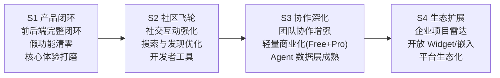

# VibeHub 产品路线图 v4.0

> 面向 Vibe Coding 时代开发者与小团队的协作平台。
> 核心策略：**开发者优先、小团队优先、社区先行、商业化克制**。

---

## 战略调整说明（v4.0，2026-04-14）

### 核心变化

1. **目标用户聚焦**：前期 100% 聚焦独立开发者和 2-10 人小团队。企业端仅作为"项目发现与投资雷达"的轻量旁观者角色存在（类似招聘网站的企业浏览模式），不再作为主力付费方。
2. **付费模型极简化**：砍掉 Team Pro（¥99/月），仅保留 **Free + Pro（$9/月）** 两档。Pro 定价面向全球开发者，采用美元计价，对标 Cursor / Replit 的个人开发者定价心智。
3. **企业能力降级为 P3+**：企业工作台、企业认证、企业席位等重型能力全部推迟。前期企业用户通过普通注册 + 公开 API / MCP 即可浏览平台数据，无需专属认证流程。
4. **前后端闭环优先**：路线图每个阶段的核心交付标准从"后端 API 存在"提升为"前后端完整闭环 + 可验收"。

### 定价设计依据

| 竞品 | 个人月费 | 核心卖点 |
|------|---------|---------|
| Cursor Pro | $20/month | AI 编辑器高级功能 |
| Replit Core | $25/month | 云开发环境 + AI |
| GitHub Pro | $4/month | 私有仓库 + 高级功能 |
| Vercel Pro | $20/month | 部署 + 带宽 |
| ProductHunt Ship | $79/month | 项目推广工具 |

VibeHub 的 $9/月定价逻辑：
- 低于工具类产品（Cursor/Replit），因为 VibeHub 是社区平台而非生产力工具
- 高于纯代码托管（GitHub），因为 VibeHub 提供项目曝光、协作匹配、AI Agent 数据层等增值能力
- 远低于推广类产品（ProductHunt Ship），降低独立开发者付费门槛
- $9 是"一杯咖啡"的心智锚点，全球开发者普遍接受

---

## Free vs Pro 功能对照

| 功能 | Free | Pro ($9/月) |
|------|------|-------------|
| **社区核心** | | |
| 浏览、发帖、评论、点赞、关注 | ✅ 完整 | ✅ 完整 |
| 创建项目 | 5 个 | **无限** |
| 项目截图 | 3 张/项目 | **10 张/项目** |
| 创建团队 | 1 个 | **5 个** |
| 团队成员上限 | 5 人 | **20 人** |
| **曝光与发现** | | |
| 项目出现在发现页 | ✅ | ✅ |
| 申请每日精选展示位 | ❌ | ✅ |
| 创作者档案高亮标识 | ❌ | ✅ Pro 徽章 |
| **开发者工具** | | |
| API 调用速率 | 60/分钟 | **600/分钟** |
| MCP 工具 | 基础 5 个（只读） | **全部 9 个（只读）** |
| API Key 数量 | 2 个 | **10 个** |
| **协作增强** | | |
| 里程碑公开展示 | ❌ | ✅ |
| 协作意向优先匹配 | ❌ | ✅ 优先展示 |
| 团队活动日志导出 | ❌ | ✅ |

### 不设付费墙的功能（永久免费）

以下功能对所有用户开放，**绝不设付费门槛**：

- 讨论广场全部读写（发帖、评论、回复、编辑、删除）
- 社交互动（点赞、收藏、关注）
- 通知系统
- 搜索
- 团队加入与协作
- 排行榜与信誉系统查看
- 公开 API 读取（匿名，有基础限速）

---

## 阶段路线图

---

## S1：产品闭环（Product Closure）

**目标：** 消灭所有假功能，让已有能力前后端完整闭环，达到"可邀请真实用户使用"的质量标准。

**核心原则：** 不新增任何功能，只打磨已有能力。

| 编号 | 任务 | 优先级 | 状态 | 验收标准 |
|------|------|--------|------|----------|
| S1-1 | 项目创建页面 `/projects/new` | 🔴 P0 | 待做 | 用户可通过 UI 创建项目，表单对接 `POST /api/v1/projects`，含验证与错误态 |
| S1-2 | 项目编辑页面 `/projects/[slug]/edit` | 🔴 P0 | 待做 | 项目创建者可编辑所有字段，对接 `PATCH /api/v1/projects/[slug]` |
| S1-3 | 团队设置页面 `/teams/[slug]/settings` | 🔴 P0 | 待做 | 团队 owner 可编辑外部链接（Discord/Telegram/Slack/GitHub），对接 `PATCH /api/v1/teams/[slug]/links` |
| S1-4 | 创作者成长面板前端展示 | 🟠 P1 | 待做 | `/creators/[slug]` 页面展示成长数据，对接 `GET /api/v1/creators/[slug]/growth` |
| S1-5 | 核心链路 E2E 测试补全 | 🟠 P1 | 待做 | 覆盖：登录 → 发帖 → 评论 → 创建项目 → 创建团队 → 通知 |
| S1-6 | OpenAPI 文档完整性补全 | 🟡 P2 | 待做 | 所有已实现路由 100% 有 OpenAPI 文档，`npm run validate:openapi` 通过 |
| S1-7 | 付费模型简化为 Free + Pro | 🟠 P1 | 待做 | 移除 Team Pro 档位，更新定价页、订阅逻辑、Stripe 配置 |
| S1-8 | UI 一致性审计 | 🟡 P2 | 待做 | 所有页面使用统一设计 token，无遗留旧风格 |

**门禁（Go/No-Go）：**
1. No Fake Feature Checklist 全部 ✅
2. 前后端 Mapping 表无 ❌ 项
3. `npm run check` 通过（lint + test + openapi + build）
4. 至少 3 名真实用户完成"注册 → 创建项目 → 发帖 → 加入团队"全流程

---

## S2：社区飞轮（Community Flywheel）

**目标：** 让社区形成"发布 → 发现 → 互动 → 再发布"的正向循环。

| 编号 | 任务 | 优先级 | 状态 | 验收标准 |
|------|------|--------|------|----------|
| S2-1 | 个性化推荐 Feed 优化 | 🟠 P1 | 已有基础 | 关注 Feed 真实返回关注用户的新内容，非空态有引导 |
| S2-2 | 搜索体验升级 | 🟠 P1 | 已有基础 | 搜索结果高亮、分类 Tab（帖子/项目/创作者），空态引导 |
| S2-3 | 创作者个人主页增强 | 🟡 P2 | 待做 | 个人主页展示项目列表、帖子列表、团队、成长趋势图 |
| S2-4 | 挑战赛前端完整闭环 | 🟡 P2 | API 已有 | `/challenges` 列表页 + `/challenges/[slug]` 详情页完整可用 |
| S2-5 | 通知聚合与体验优化 | 🟡 P2 | 已有基础 | 同类通知合并（"3 人赞了你的帖子"），已读/未读体验流畅 |
| S2-6 | 项目画廊每日精选强化 | 🟡 P2 | 已有基础 | 首页和发现页顶部展示每日精选，管理端操作闭环 |

**门禁：**
1. 讨论帖平均评论数 ≥ 2
2. 项目页有效互动率（点赞+收藏+协作意向）≥ 15%
3. 搜索成功率（搜索后有点击）≥ 40%

---

## S3：协作深化 + 轻量商业化（Collaboration + Monetization）

**目标：** 让团队协作成为平台核心行为，同时以最小侵入方式引入 Pro 付费。

| 编号 | 任务 | 优先级 | 状态 | 验收标准 |
|------|------|--------|------|----------|
| S3-1 | Stripe Pro 订阅闭环 | 🟠 P1 | 已有基础 | 完整的 checkout → webhook → 订阅管理 → 降级流程 |
| S3-2 | Pro 功能门控落地 | 🟠 P1 | 已有基础 | 项目数/团队数/API 速率等限制真实生效，触发升级引导 |
| S3-3 | 协作意向流程优化 | 🟠 P1 | 已有 | 意向通过后自动引导加入团队，全流程通知闭环 |
| S3-4 | 团队任务看板优化 | 🟡 P2 | 已有基础 | 拖拽排序、批量状态变更、任务详情页 |
| S3-5 | 信誉系统前端展示 | 🟡 P2 | API 已有 | 创作者档案展示贡献分数与排名，排行榜页面完整 |
| S3-6 | MCP v2 成熟化 | 🟡 P2 | 已有基础 | 文档完整、示例丰富、错误处理健壮、审计日志完整 |

**门禁：**
1. 新增项目中 Team 项目占比 ≥ 20%
2. Pro 付费转化率 ≥ 2%
3. MCP 工具日调用量 ≥ 100

---

## S4：生态扩展（Ecosystem Expansion）

**目标：** 从产品升级为轻量生态基础设施，企业以旁观者身份参与。

| 编号 | 任务 | 优先级 | 状态 | 验收标准 |
|------|------|--------|------|----------|
| S4-1 | 企业项目雷达（轻量版） | 🟡 P2 | API 已有 | 企业用户通过普通注册+公开 API 浏览项目雷达和人才雷达，无需专属认证 |
| S4-2 | 嵌入 Widget | 🟡 P2 | API 已有 | 外部网站可嵌入项目卡片和团队卡片，embed API 完整可用 |
| S4-3 | 生态报告 | 🟡 P2 | API 已有 | 季度开发者生态报告自动生成，公开可访问 |
| S4-4 | MCP 写工具（审慎引入） | 🟡 P2 | 未做 | 经过充分安全评估后引入 `create_post`、`create_project` 等写工具 |
| S4-5 | 企业认证与工作台（视市场反馈） | 🟡 P3 | 已有基础 | 仅当企业端有明确付费需求时才启动，不提前投入 |

**门禁：**
1. API / MCP 外部调用占比 ≥ 30%
2. 嵌入 Widget 被 ≥ 10 个外部站点使用
3. 企业端启动前需要明确的 PMF 信号

---

## 企业能力的阶段性处理策略

### 前期（S1-S3）：旁观者模式

企业用户 = 普通注册用户 + 公开 API 访问。他们可以：
- 浏览所有公开项目、创作者、团队
- 使用搜索和筛选发现项目
- 通过 API / MCP 工具检索平台数据
- 查看排行榜和生态报告

**不需要**专属认证、专属工作台、专属定价。

### 后期（S4+）：视市场信号决定

只有当以下信号出现时才启动企业专属能力：
1. ≥ 5 家企业主动询问付费方案
2. 企业用户 API 调用占比 ≥ 20%
3. 有明确的"关注列表"或"尽调面板"需求

---

## 已完成能力清单（继承自 v3.x 路线图）

### 基础设施（全部完成）
- [x] GitHub OAuth 登录
- [x] 创作者档案自助注册与编辑
- [x] 项目展示字段补全
- [x] 移动端导航
- [x] 安全加固（CSP、速率限制、签名会话）
- [x] PostgreSQL + Prisma 模型
- [x] CI/CD 质量门（lint + test + openapi + build）

### 社区核心（全部完成）
- [x] 讨论广场（发帖、评论、嵌套回复、编辑、删除）
- [x] 社交互动（点赞、收藏、关注）
- [x] 通知系统（站内通知、未读计数、标记已读）
- [x] 个性化推荐 Feed
- [x] 项目画廊每日展示位
- [x] GitHub 仓库展示集成
- [x] 全文搜索
- [x] 排行榜（全量 + 周榜）
- [x] 精华机制
- [x] 挑战赛 API

### 协作（全部完成）
- [x] Team 体系（创建、申请加入、审批）
- [x] 团队任务看板（三列、排序、里程碑关联）
- [x] 团队里程碑
- [x] 外部聊天绑定（Discord/Telegram/Slack）
- [x] 协作意向流程
- [x] WebSocket 实时聊天（已实现，备用）

### 开发者基础设施（全部完成）
- [x] 用户级 API Key（SHA-256 哈希存储）
- [x] API Key Scope 权限
- [x] Bearer 速率限制（内存 + 可选 Redis）
- [x] OpenAPI 3.0 导出与 CI 校验
- [x] MCP v2 读端（9 工具 + 审计日志）
- [x] MCP stdio 传输层
- [x] 公开 API 镜像（无鉴权）
- [x] 嵌入 Widget API + oEmbed
- [x] 企业雷达 API（项目雷达、人才雷达、尽调）
- [x] 生态报告 API

### 管理后台（全部完成）
- [x] Admin 隔离布局与权限
- [x] 用户管理、内容审核、协作意向审核
- [x] 审计日志、MCP 调用审计

---

## 被明确推迟的能力（不在当前路线图内）

| 能力 | 原计划 | 推迟原因 | 重启条件 |
|------|--------|----------|----------|
| Team Pro 档位（¥99/月） | P3 | 前期用户基数不足以支撑多档位定价 | Pro 付费用户 ≥ 500 且有团队付费需求 |
| 企业认证流程 | P4 | 前期无企业付费 PMF | ≥ 5 家企业主动询问 |
| 企业专属工作台 | P4 | 同上 | 同上 |
| 企业席位定价 | P4 | 同上 | 同上 |
| MCP 写工具 | P4 | 安全风险需充分评估 | 读端日调用 ≥ 500 且有写需求 |
| 支付宝/微信支付 | P3 | 先用 Stripe 覆盖全球开发者 | 中国区用户占比 ≥ 40% |

---

## 变更记录

| 日期 | 版本 | 变更 |
|------|------|------|
| 2026-04-14 | v4.0 | **战略转型**：开发者优先 + 小团队优先；砍掉 Team Pro 档位，仅保留 Free + Pro ($9/月)；企业能力降级为旁观者模式推迟到 S4+；路线图从 P1-P4 重构为 S1-S4（Stage，强调阶段而非优先级）；定价采用美元全球化定价 |
