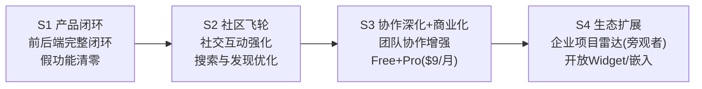

> ⚠️ 已归档：本文件仅供历史参考，不得作为当前实现依据。当前主线请看 `docs/roadmap-current.md` 与 v11 系列文档。

# VibeHub 实现计划图（阶段制）

版本：v4.0  
更新日期：2026-04-14

## 总体路线（v4.0 — 开发者优先）

> **v4.0 战略调整要点：**
> 1. 付费模型极简化：砍掉 Team Pro（¥99/月），仅保留 **Free + Pro ($9/月)**
> 2. 企业能力降级：前期企业用户 = 普通注册 + 公开 API，无需专属认证/工作台
> 3. 前后端闭环优先：每个阶段的交付标准从"API 存在"提升为"可验收的完整闭环"
> 4. 目标用户：独立开发者 + 2-10 人小团队

### P1-P4 历史阶段（已完成，归档于下方）

## P1 当前已落地（本仓库）

1. Next.js 全栈骨架（App Router + API Route）
2. 讨论广场 API 与页面（`GET/POST /api/v1/posts`，`GET /api/v1/posts/:slug`，`sort=hot` 热度排序）
3. 评论完整 CRUD（`GET/POST /api/v1/comments`，`PATCH/DELETE /api/v1/comments/:commentId`）
4. 项目画廊完整 CRUD（`POST /api/v1/projects`，`PATCH/DELETE /api/v1/projects/:slug`，`creatorId` 筛选）
5. 创作者 API 与详情页
6. MCP v1 三个只读工具端点
7. 统一 `/api/v1` 响应协议
8. PostgreSQL + Prisma 模型与 seed 脚本
9. 自托管部署模板（Nginx/PM2/Postgres）
10. 内容规范 API（`GET /api/v1/content-guidelines`：项目提交模板、帖子指南、质量标准、审核规则）

## 阶段门禁（强约束）

1. P1 -> P2：核心链路可用率、检索成功率、项目字段完整率、7日留存达标
2. P2 -> P3：有效互动率、项目二次更新率、审核SLA达标
3. P3 -> P4：Team项目占比、里程碑完成率、付费转化/留存达标

## 变更记录

| 日期 | 版本 | 变更 |
|---|---|---|
| 2026-04-12 | v1.0 | 初始化阶段实现图并与代码仓库对齐 |
| 2026-04-12 | v1.1 | 补充 P1 门禁执行结果（安全修复、测试链路、CI 自动验收） |
| 2026-04-12 | v1.2 | P2 全量收口：按 P2-1…P2-5 汇总执行记录，并对照计划书标注延期项 |
| 2026-04-12 | v1.3 | 启动 P3：`Team` + `TeamMembership`、公开团队 API 与 `/teams` 最小页面（P3-1） |
| 2026-04-12 | v1.4 | P3-2：团队入队改为申请 + 队长审批（`TeamJoinRequest`） |
| 2026-04-12 | v1.5 | P3-3：项目可选归属团队（`Project.teamId`）、发现页按团队筛选、创建者 PATCH 绑定 |
| 2026-04-12 | v1.6 | P3-4：团队轻量任务板 `TeamTask`（todo/doing/done）、成员 API + `/teams/[slug]` 任务区 |
| 2026-04-12 | v1.7 | P3-5：`TeamMilestone` 时间线（目标日、完成态、sortOrder）；mock 成员行 id 去重修复 |
| 2026-04-12 | v1.8 | P3-6：`TeamTask.sortOrder`、列表排序、创建默认递增、PATCH 可选 sortOrder、`POST .../tasks/:id/reorder` |
| 2026-04-12 | v1.9 | P3-1…P3-6 全量代码审计与收口：合并主线、`createTeam` slug 冲突长度修复（BUG-P3-1-002）、文档与 Debug 表闭环 |
| 2026-04-13 | v2.0 | P3-7：`TeamTask.milestoneId` 可选关联本团队 `TeamMilestone`（`ON DELETE SET NULL`）；删除里程碑时 mock 清关联 + DB `updateMany`；任务 API/UI 可选 `milestoneId` |
| 2026-04-13 | v2.1 | P3 主线扫尾：`TeamTasksPanel` 按 todo/doing/done 三列看板；`reorderTeamTask` 仅在**同一状态列**内交换相邻 `sortOrder` |
| 2026-04-13 | v2.2 | **P3 正式封版**：P3-1…P3-7 + 看板扫尾已合入 `main`；团队通知/站内提醒等列入 P3 之后（见封版结论与延期表） |
| 2026-04-13 | v2.3 | **P4-1 启动**：用户级 `ApiKey`（SHA-256+pepper 仅存哈希）、`GET/POST /api/v1/me/api-keys`、`DELETE .../me/api-keys/:id`；`Authorization: Bearer` 与 Cookie 会话并行（首接 `GET /api/v1/me/teams`）；`/settings/api-keys` |
| 2026-04-13 | v2.4 | **P4-2**：`ApiKey.scopes`（JSON 数组）；`authenticateRequest(req, scope)`；多组只读 GET + MCP search/detail 需 Cookie 或带 scope 的 Bearer；`read:public` 必选 |
| 2026-04-13 | v2.5 | **P4-3**：Bearer **速率限制**（`API_KEY_RATE_LIMIT_PER_MINUTE`）；`GET /api/v1/projects` 等恢复 **匿名可读**；`/api/v1/public/*` 无鉴权镜像；创建 Key **scope 勾选 UI** |
| 2026-04-13 | v2.6 | **P4-4**：`GET /api/v1/openapi.json` 返回 **OpenAPI 3.0**（`buildOpenApiDocument`）；描述 envelope、鉴权、scope、public 镜像与主要路径；顶栏 OpenAPI 链接 |
| 2026-04-13 | v2.7 | **P4-5**：`openapi-validate`（Zod 根结构 + 必选 path 清单）；`npm run validate:openapi`；`npm run check` 纳入；CI `p1-gate` 在 Test 与 Build 之间跑校验 |
| 2026-04-14 | v2.8 | **P3 顺延收口 + P4 企业/MCP v2**：`InAppNotification` 模型；入队/审批/任务分配通知；`GET/PATCH /api/v1/me/notifications`；任务 **RBAC**（成员仅改本人创建或本人被指派；删除仅创建者或队长；`reorder` 同规则）；`write:team:tasks` Bearer 写任务；`read:enterprise:workspace` + `GET /api/v1/me/enterprise/workspace` + `/workspace/enterprise`；**MCP v2** `GET /api/v1/mcp/v2/manifest` + `POST /api/v1/mcp/v2/invoke`（按 tool 校验 scope） |
| 2026-04-14 | v2.9 | **推送渠道 + MCP 审计 + Redis 限流**：可选 `NOTIFICATION_WEBHOOK_URL`（HMAC `NOTIFICATION_WEBHOOK_SECRET`）+ 可选 **SMTP**；`McpInvokeAudit` 表 + `POST /api/v1/mcp/v2/invoke` 全路径写审计 + 管理端 `GET /api/v1/admin/mcp-invoke-audits`；`REDIS_URL` 时 Bearer 限流走 **Redis**（失败回退内存）；`SessionUser.apiKeyId` |
| 2026-04-13 | v3.0 | **P1 后端补全**：帖子详情 `GET /api/v1/posts/:slug`（含评论分页）；评论列表 `GET /api/v1/comments?postId=`；评论 PATCH/DELETE（作者/管理员权限）；帖子热度排序 `sort=hot`；项目完整 CRUD `POST/PATCH/DELETE`；`listProjects` `creatorId` 筛选；内容规范 API `GET /api/v1/content-guidelines`；OpenAPI spec 扩展；25 新测试 |
| 2026-04-13 | v3.1 | **P2 后端补全**：精华机制 `Post.featuredAt` + 管理端标记/取消 + `sort=featured`；挑战赛 `Challenge` 模型 CRUD；创作者成长面板 `GET /api/v1/creators/:slug/growth`；OpenAPI 40 路径；19 新测试（110 总计） |
| 2026-04-13 | v3.2 | **P3 后端补全**：协作日志 `GET /teams/:slug/activity-log`；信誉系统 `ContributionCredit` + 积分计算 + 排行榜；商业化首发 `SubscriptionPlan` + `UserSubscription` + Pro/Team Pro 订阅 CRUD；OpenAPI 46 路径；17 新测试（127 总计） |
| 2026-04-13 | v3.3 | **P4 后端补全**：嵌入 Widget `GET /embed/projects/:slug` + `embed/teams/:slug` + oEmbed；企业雷达 `GET /enterprise/project-radar` + `talent-radar` + `due-diligence/:slug`；生态报告 `GET /reports/ecosystem`；CORS 支持；OpenAPI 53 路径；16 新测试（143 总计） |
| 2026-04-14 | v3.4 | **P0-3 企业认证闭环收口**：新增 `GET/POST /api/v1/me/enterprise/verification`（申请 + 状态查询）；新增 `GET/PATCH /api/v1/admin/enterprise/verifications`（按状态分页审核）；`/enterprise/verify` 从占位表单改为真实提交与状态展示；`/workspace/enterprise` 门禁升级为基于 enterpriseStatus（none/pending/rejected/approved）的状态机导航。 |
|| 2026-04-14 | v4.0 | **战略转型 — 开发者优先 + 付费简化**：砍掉 `team_pro` 档位，仅保留 `free` + `pro`（$9/月 USD）；Prisma enum 迁移移除 `team_pro`；`subscription.ts` 重写限额（Free: 5 项目/60 API/min; Pro: 无限项目/600 API/min）；`pricing-cards` 重写为双栏+对比表；企业能力降级为旁观者模式（普通注册 + 公开 API），推迟专属认证/工作台；路线图从 P1-P4 重构为 S1-S4（Stage）；更新计划书 §5 商业模式 |

## P4 Backend Completion — Embed/Widget + Enterprise Radar + Ecosystem Reports (2026-04-13)

- **Embed / Widget API (CORS enabled)**: `GET /api/v1/embed/projects/:slug` and `GET /api/v1/embed/teams/:slug` — embeddable JSON cards for external sites with full CORS headers; `GET /api/v1/oembed?url=` — oEmbed discovery endpoint returning rich-type JSON for `/projects/*` URLs.
- **Enterprise project radar**: `GET /api/v1/enterprise/project-radar` — trending projects ranked by weighted score (collaboration intents * 15 + recency bonus); scoped behind `read:enterprise:workspace`.
- **Enterprise talent radar**: `GET /api/v1/enterprise/talent-radar` — top creators ranked by `ContributionCredit.score`; includes skills, preference, project count.
- **Due diligence summary**: `GET /api/v1/enterprise/due-diligence/:slug` — deep project info including team member count, collaboration intent count, comment count, creator profile.
- **Ecosystem reports**: `GET /api/v1/reports/ecosystem?period=` — platform-wide metrics aggregation: total users/projects/posts/comments/teams/intents, top projects by intents, top discussions by comments, top creators by score.
- **CORS module**: `web/src/lib/cors.ts` — reusable `corsHeaders()` and `corsPreflightResponse()` for embed endpoints.
- **OpenAPI**: expanded to 53 paths including all new P4 endpoints.
- **Tests**: 16 new test cases across 3 test files; 143 total tests passing.

## P3 Backend Completion — 协作日志 + 信誉系统 + 商业化首发 (2026-04-13)

- **协作日志 (Team Activity Log)**: `GET /api/v1/teams/:slug/activity-log` — team-scoped view of `AuditLog` entries filtered by `entityType` and `metadata.teamId`; paginated; requires `read:team:detail` scope; `listTeamActivityLog` repository function.
- **信誉系统 (Contribution Credits)**: `ContributionCredit` model with per-user aggregated scores; `GET /api/v1/me/reputation` (current user), `POST /api/v1/me/reputation` (recompute from source data); `GET /api/v1/reputation/leaderboard` (public top-N); scoring weights: tasks(10), milestones(25), posts(15), comments(5), projects(20), intents(10), joins(3).
- **商业化首发 (Subscription / Pro Membership)**: `SubscriptionPlan` model (free/pro/team_pro tiers with features list and API quota); `UserSubscription` model (userId+planId unique, status active/canceled/past_due, period tracking); `GET /api/v1/subscription-plans` (public); `GET/POST/DELETE /api/v1/me/subscription` (current user subscribe/cancel).
- **Migration**: `20260417000000_p3_reputation_subscription`.
- **OpenAPI**: expanded to 46 paths including all new P3 endpoints.
- **Tests**: 17 new test cases across 3 test files; 127 total tests passing.

## P2 Backend Completion — 精华 + 挑战赛 + 创作者成长 (2026-04-13)

- **精华机制 (Featured Posts)**: `Post.featuredAt` / `Post.featuredBy` fields; Prisma migration `20260416000000_p2_featured_challenge_creator_growth`; admin `POST/DELETE /api/v1/admin/posts/:postId/feature`; `GET /api/v1/posts/featured` (featured-only feed); `listPosts` supports `sort=featured` and `featuredOnly` filter; `featurePost` / `unfeaturePost` repository functions.
- **挑战赛活动页 (Challenge Campaigns)**: `Challenge` model with `ChallengeStatus` enum (`draft` / `active` / `closed`); `GET/POST /api/v1/challenges` (list with status filter, admin create); `GET/PATCH/DELETE /api/v1/challenges/:slug`; full CRUD in repository; mock data with two sample challenges.
- **创作者成长面板 (Creator Growth Dashboard)**: `GET /api/v1/creators/:slug/growth` returns `CreatorGrowthStats` — post count, comment count, project count, featured post count, collaboration intent count, received comment count; `getCreatorGrowthStats` repository function with mock + Prisma paths using parallel `COUNT` queries.
- **OpenAPI**: expanded to 40 paths including all new P2 endpoints.
- **Tests**: 19 new test cases across 3 new test files (`p2-featured-posts.test.ts`, `p2-challenges.test.ts`, `p2-creator-growth.test.ts`); 110 total tests passing.

## P1 Backend Completion (2026-04-13)

- **Post detail**: `GET /api/v1/posts/:slug` returns post with paginated comments; `getPostBySlug` repository function; `read:posts:detail` API key scope.
- **Comments CRUD**: `GET /api/v1/comments?postId=` for listing; `PATCH/DELETE /api/v1/comments/:commentId` for author editing and admin/author deletion; `listCommentsForPost`, `updateComment`, `deleteComment` repository functions.
- **Hot sort**: `listPosts` accepts `sort=hot` — ranks by comment count desc, then recency; mock in-memory sort; Prisma raw SQL with LEFT JOIN on Comment.
- **Project CRUD**: `POST /api/v1/projects` (requires creator profile); `PATCH /api/v1/projects/:slug` extended for field updates (title, oneLiner, description, techStack, tags, status, demoUrl) in addition to teamSlug; `DELETE /api/v1/projects/:slug` (creator or admin).
- **Creator project filter**: `listProjects` and `GET /api/v1/projects` accept `creatorId` parameter for proper paginated filtering.
- **Content guidelines**: `GET /api/v1/content-guidelines` returns structured project submission template, post guidelines, quality standards, and review rules; `web/src/lib/content-guidelines.ts`.
- **OpenAPI**: 33 paths including new posts, comments, projects CRUD, and content-guidelines.
- **Tests**: 25 new test cases across `p1-post-detail.test.ts`, `p1-comment-crud.test.ts`, `p1-project-crud.test.ts`.

## Push channels + MCP audit + Redis rate limit (2026-04-14)

- **Push**: `dispatchNotificationPush` after in-app row (mock + DB): JSON POST webhook + optional nodemailer SMTP (`SMTP_*` in `.env.example`).
- **MCP audit**: `McpInvokeAudit` model; `logMcpInvoke` from invoke handler (parse/auth/business/500); admin list API.
- **Redis RL**: `checkApiKeyRateLimitAsync` in `authenticateRequest` when `REDIS_URL` set; `ioredis` dependency.

## P3 deferral closure + P4 enterprise / MCP v2 (2026-04-14)

- **Notifications**: Prisma `InAppNotification` + mock `mockInAppNotifications`; triggers on join request (to owner), approve/reject (to applicant), assignee change (to assignee); pages `/notifications`, API `me/notifications`.
- **Task RBAC**: `assertTeamTaskMutateAllowed` centralizes update/delete/reorder rules for members vs owner.
- **Open API writes**: Team task `POST/PATCH/DELETE` and `reorder` accept session or Bearer with `write:team:tasks`.
- **Enterprise workspace**: `getEnterpriseWorkspaceSummary` aggregates pending join requests (owned teams), collaboration funnel, `listTeamsForUser`; exposed as API + SSR page.
- **MCP v2**: Public manifest lists tools and required scopes; single `invoke` endpoint dispatches to repository (auditable path for future logging).

## P4-5 Execution Update (2026-04-13) — OpenAPI CI validation

- **Module**: `web/src/lib/openapi-validate.ts` — `validateOpenApiDocument`, `REQUIRED_OPENAPI_PATHS`, `buildAndValidateOpenApiDocument`.
- **CLI**: `web/scripts/validate-openapi.ts`; package script `validate:openapi`; `check` = lint → test → **validate:openapi** → build.
- **CI**: `.github/workflows/p1-gate.yml` step after Vitest, before production build.
- **Tests**: `openapi-spec.test.ts` asserts structural validation passes on generated doc.

## P4-4 Execution Update (2026-04-13) — OpenAPI export

- **Endpoint**: `GET /api/v1/openapi.json` — public, `application/json`, short `Cache-Control`.
- **Source**: `web/src/lib/openapi-spec.ts` (curated subset of v1 routes + auth/rate-limit notes).
- **UI**: Site header link to spec in new tab.
- **Contract gate**: structural checks and a small required-path allowlist ship as **P4-5** (`openapi-validate`, `npm run validate:openapi`, CI). Longer term, codegen from route metadata can further reduce drift.

## P4-3 Execution Update (2026-04-13) — Public mirrors + rate limit

- **Rate limit**: In-memory rolling window per `SHA256(token)+IP`; 429 + `Retry-After`; env `API_KEY_RATE_LIMIT_PER_MINUTE` (default 120).
- **Auth refactor**: `authenticateRequest` → `AuthResult`; `resolveReadAuth` for optional anonymous reads; `rateLimitedResponse` helper.
- **Anonymous reads restored**: `GET /api/v1/projects`, `projects/:slug`, `teams`, `teams/:slug`, creators, collection-topics (same paths as before P4-2 break).
- **Public namespace**: `GET /api/v1/public/projects`, `public/projects/:slug`, `public/teams`, `public/teams/:slug`, `public/creators`, `public/creators/:slug`, `public/collection-topics`, `public/collection-topics/:slug` — no cookie/Bearer required.
- **Still gated** (cookie or scoped Bearer): `me/teams`, team tasks/milestones GET, MCP tools GET.
- **UI**: `ApiKeysPanel` checkboxes for optional scopes (`read:public` fixed on).

## P4-2 Execution Update (2026-04-13) — Scoped read APIs

- **Data**: `ApiKey.scopes` JSONB; migration `20260413120000_p4_2_api_key_scopes` (backfill + drop column default).
- **Auth**: `SessionUser.apiKeyScopes`; `getSessionUserFromApiKeyToken` loads scopes; `authenticateRequest` checks `request.cookies` first then `cookies()` then Bearer; per-route `requiredScope`.
- **Routes gated** (cookie or Bearer with scope): `GET` projects list/detail, teams list/detail, team tasks/milestones, creators list/detail, collection-topics list/detail, `me/teams`, MCP `search_projects`, `search_creators`, `get_project_detail`.
- **API**: `POST /me/api-keys` optional `scopes` array; UI sends default scope set.

## P4-1 Execution Update (2026-04-13) — Open API keys

- **Data**: `ApiKey` model (`label`, `keyHash` unique, `prefix`, `lastUsedAt`, `revokedAt`); migration `20260413100000_p4_1_api_keys`.
- **Security**: plaintext `vh_…` shown once on create; store `SHA256(pepper:token)`; env `API_KEY_HASH_PEPPER` required in production (see `web/.env.example`).
- **Auth**: `getSessionUserFromRequest` — cookie session first, else Bearer API key lookup.
- **UI**: `ApiKeysPanel` + `/settings/api-keys`; nav **API Keys**.
- **Tests**: `tests/api-key-repository.test.ts`.

## P3 Formal Closure — 封版结论 (2026-04-13)

- **本阶段纳入并冻结的范围**：团队与成员（P3-1）、入队申请与审批（P3-2）、项目归属团队与发现筛选（P3-3）、团队任务板（P3-4）、里程碑（P3-5）、任务排序与列内 reorder（P3-6）、任务↔里程碑关联（P3-7）、状态分列看板与列内重排语义（扫尾）。
- **曾顺延、现已在本仓库补齐（2026-04-14）**：站内 **`InAppNotification`** + 团队任务 **RBAC**（见 v2.8）。**仍顺延**：付费/订阅；更重的企业席位/计费与尽调面板。
- **门禁**：封版前以 `main` 上 `npm run check`（lint + vitest + build）为验收；迁移链 `20260412140000` … `20260413000000` 与 CI `prisma migrate deploy` 策略保持不变；mock `createTeam` id 去重（BUG-P3-1-003）保证封版验证稳定。
- **下一正式阶段**：按路线图进入 **P4** 准备（基础设施化 / 企业工作台 / 开放 API 等），团队通知可作为 P4 前热修或 P4 首包。

## P3 Mainline Sweep — Kanban UI + column-scoped reorder (2026-04-13)

- **UI**: `team-task-board` / `team-task-column` CSS；任务按状态分列，列内仍按 `sortOrder` + `updatedAt`。
- **API semantics**: `POST .../tasks/:id/reorder` 的相邻交换限定为 **相同 `status`**，与看板列一致。
- **Cross-column move**: 仍通过 `PATCH` 修改 `status`（`sortOrder` 保留，列内顺序独立）。

## P3-7 Execution Update (2026-04-13)

- **Data**: `TeamTask.milestoneId` FK → `TeamMilestone` (`ON DELETE SET NULL`); migration `20260413000000_p3_7_team_task_milestone_link`; `TeamMilestone.tasks` back-relation.
- **Repo**: `listTeamTasks` includes `milestoneTitle`; `createTeamTask` / `updateTeamTask` validate milestone belongs to team; `deleteTeamMilestone` clears links on tasks (mock + Prisma).
- **API**: optional `milestoneId` on `POST/PATCH .../tasks` (`null` to unlink); `400 TEAM_MILESTONE_NOT_FOUND` when id not in team.
- **UI**: `TeamTasksPanel` milestone picker (milestones loaded server-side for members on team detail page).
- **Seed**: milestones created before tasks; first seed task links to first milestone by id.

## P3-1…P3-6 Full Audit Closure (2026-04-12)

- **Scope**: Prisma 迁移 `20260412140000` … `20260412230000`；`web/src/app/api/v1/teams/**`、`projects/[slug]`、`me/teams`、discover/MCP 团队筛选；`repository` 团队/入队/项目绑定/任务/里程碑与 Vitest。
- **Fix shipped**: `buildTeamSlugCandidate` 保证冲突后缀下 slug **≤48**，mock 与 PostgreSQL 路径一致。
- **Deferred (documented)**: 任务板仍为「任意成员可删任意任务」MVP；`createTeam` DB 路径 slug 碰撞最多尝试 20 次（极端高密度碰撞需产品或运维策略）。

## P3-6 Execution Update (2026-04-12)

- **Data**: `TeamTask.sortOrder` (default 0), index `(teamId, sortOrder)`; migration `20260412230000_p3_6_team_task_sort_order`.
- **API**: optional `sortOrder` on `POST/PATCH .../tasks`; `POST .../tasks/:taskId/reorder` with `{ direction: "up" | "down" }` returns `{ tasks }` (full ordered list).
- **Repo**: `listTeamTasks` orders by `sortOrder` then `updatedAt`; `createTeamTask` appends with `max+1` when `sortOrder` omitted; `reorderTeamTask` swaps adjacent rows **within the same status** (mock + Prisma; see v2.1 sweep).
- **UI**: `TeamTasksPanel` 上移/下移 buttons.
- **Seed**: explicit `sortOrder` on seeded team tasks.

## P3-5 Execution Update (2026-04-12)

- **Data**: `TeamMilestone` (`title`, `description?`, `targetDate`, `completed`, `sortOrder`, `createdByUserId`); migration `20260412220000_p3_5_team_milestones`.
- **API**: `GET/POST /api/v1/teams/:slug/milestones`; `PATCH/DELETE .../milestones/:milestoneId` (members only).
- **UI**: `TeamMilestonesPanel` on `/teams/[slug]` (date picker uses UTC noon for ISO consistency).
- **Seed**: replace+create two milestones for `vibehub-core`.
- **Mock fix**: `mockTeamMemberships` rows use composite ids to avoid `removeTeamMember` deleting wrong row when `Date.now()` collides (same class of bug as P3-2 join requests).

## P3-4 Execution Update (2026-04-12)

- **Data**: `TeamTask` + `TeamTaskStatus`; migration `20260412200000_p3_4_team_tasks`; seed replaces then inserts two tasks on `vibehub-core`.
- **Rules**: list/create/update/delete require **team membership**; assignee must be a member; any member may mutate tasks (MVP).
- **API**: `GET/POST /api/v1/teams/:slug/tasks`; `PATCH/DELETE /api/v1/teams/:slug/tasks/:taskId`.
- **UI**: `TeamTasksPanel` on team detail (client fetch); CSS `.status-todo|doing|done`.
- **Tests**: `tests/team-task-repository.test.ts`.

## P3-3 Execution Update (2026-04-12)

- **Data**: optional `Project.teamId` FK → `Team` (`ON DELETE SET NULL`); migration `20260412180000_p3_3_project_team_link`.
- **API**: `GET /api/v1/projects` and MCP `search_projects` accept `team=<teamSlug>`; `GET /api/v1/projects/:slug` returns `team` summary; `PATCH /api/v1/projects/:slug` with `{ "teamSlug": "..." | null }` (creator only, must be team member); `GET /api/v1/me/teams` lists teams for session user.
- **UI**: `/discover` team filter; team detail shows linked projects + link to discover; project detail shows `ProjectTeamLinkForm` for creator; `ProjectCard` shows team when set.
- **Seed**: links `vibehub` project to `vibehub-core` team after team upsert.
- **Tests**: `tests/team-project-link.test.ts`, `project-list-filters` team filter case.

## P3-1 Execution Update (2026-04-12)

- Data: `Team` (slug, name, mission, ownerUserId), `TeamMembership` (unique teamId+userId, role `owner` | `member`), migration `20260412140000_p3_1_teams`.
- API: `GET/POST /api/v1/teams`, `GET /api/v1/teams/:slug`, `POST /api/v1/teams/:slug/members` (owner adds by email), `DELETE /api/v1/teams/:slug/members/:userId` (self-leave or owner removes member).
- UI: `/teams`, `/teams/[slug]`, nav **Teams**; seed team `vibehub-core` in `prisma/seed.ts`.
- Tests: `tests/team-repository.test.ts`.

## P3-2 Execution Update (2026-04-12)

- **Join flow change**: `POST /api/v1/teams/:slug/join` now creates a **`TeamJoinRequest`** (pending) instead of immediate membership; owner approves or rejects via `POST /api/v1/teams/:slug/join-requests/:requestId/review` with `{ "action": "approve" | "reject" }`.
- **Data**: `TeamJoinRequest` + `TeamJoinRequestStatus`, unique `(teamId, applicantId)`; migration `20260412160000_p3_2_team_join_requests`.
- **Detail API/page**: `GET /api/v1/teams/:slug` and server page pass session so response can include `viewerPendingJoinRequest` and owner-only `pendingJoinRequests`.
- **Invite by email**: still direct-add; clears any pending join request for that user on the team (DB + mock).
- **Re-apply after reject**: same `(teamId, applicantId)` row is updated back to `pending` (unique constraint friendly).
- **Tests**: extended `tests/team-repository.test.ts` for request/approve/reject paths.

## P2 执行切片（P2-1 — P2-5，按交付顺序）

### P2-1 Execution Update (2026-04-12)

- Admin RBAC (demo session + `requireAdminSession`), moderation queue for posts, user list, reports and audit log listing APIs; admin UI routes under `/admin/*`.
- Quality gate: `npm run check` maintained on admin routes.

### P2-2 Execution Update (2026-04-12)

- Collaboration intent loop for project pages (`join` / `recruit`) with API and admin moderation queue.
- `CollaborationIntent` model, repository flows, audit log actions; admin collaboration queue and review endpoint.
- Tests: `tests/collaboration-intent-repository.test.ts`.

### P2-3 Execution Update (2026-04-12)

- Topic collections: curated slugs in `src/lib/topics-config.ts`, pages `/collections` and `/collections/[slug]`, APIs `GET /api/v1/collection-topics` and `GET /api/v1/collection-topics/[slug]`.
- Leaderboards: `/leaderboards` plus `GET /api/v1/leaderboards/discussions` and `GET /api/v1/leaderboards/projects` (all-time comment count and collaboration intent volume).
- Collaboration intent funnel: `GET /api/v1/metrics/collaboration-intent-funnel` and admin dashboard section fed by `getCollaborationIntentConversionMetrics`.
- Tests: `tests/p2-3-discovery-metrics.test.ts` (mock data path).

### P2-4 Execution Update (2026-04-12)

- Project discovery (ops / external radar): page `/discover` with GET form (shareable query string: `query`, `tag`, `tech`, `status`, `page`, `limit`).
- API: `GET /api/v1/projects` accepts `tech` and `status`; `GET /api/v1/projects/facets` returns distinct `tags` and `techStack` for filter dropdowns; MCP `search_projects` accepts the same optional filters with strict `status` validation.
- Repository: `listProjects` extended filters; `getProjectFilterFacets`; tests in `tests/project-list-filters.test.ts`.

### P2-5 Execution Update (2026-04-12)

- Weekly leaderboards: UTC weeks (Monday boundary); live queries count comments or collaboration intents created within `[weekStart, weekStart+7d)`.
- Materialized snapshots: Prisma models `WeeklyLeaderboardSnapshot` and `WeeklyLeaderboardRow`, migration `20260412120000_p2_5_weekly_leaderboard_snapshots`.
- Public APIs: `GET /api/v1/leaderboards/weekly/discussions` and `GET /api/v1/leaderboards/weekly/projects` with optional `week=YYYY-MM-DD` (Monday); responses include `source: materialized | live`.
- Admin: `POST /api/v1/admin/leaderboards/weekly/materialize` plus dashboard form; audit action `weekly_leaderboard_materialized`.
- UI: `/leaderboards` shows all-time and weekly panels with week navigation query string.
- Tests: `tests/p2-5-weekly-leaderboards.test.ts`.

## P2 对照《项目计划书》4.2 的收口结论（2026-04-12）

| 计划书交付物 | 本仓库状态 | 说明 |
|---|---|---|
| 精华机制 | **已交付** | `Post.featuredAt` + 管理端精华标记/取消 + `sort=featured` + `/api/v1/posts/featured` |
| 周榜 | 已交付 | 全量榜（P2-3）+ UTC 周榜与可选物化快照（P2-5） |
| 专题页 | 已交付 | 配置驱动专题 `/collections`（P2-3） |
| 挑战赛活动页 | **已交付** | `Challenge` 模型 + CRUD API + 管理端创建/编辑/删除 |
| 投资者筛选视图（只读） | 已交付（运营向） | `/discover` + 项目筛选 API / MCP（P2-4） |
| 协作意向入口 | 已交付 | 项目页提交 + 管理端审核（P2-2） |
| 创作者成长面板 | **已交付** | `GET /api/v1/creators/:slug/growth` 返回帖子/评论/项目/精华/协作意向/被评论数 |
